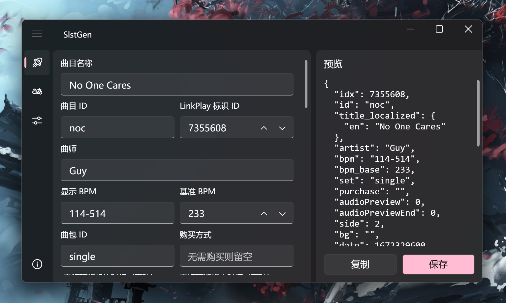



# SlstGen

Arcaea 曲目信息 (songlist) 生成器

SlstGen 是一个为 Arcaea 谱师制作的小工具，用于便捷生成供游戏本体读取的 `songlist` 信息，基于 .NET 7 + WPF 开发。

## 特性

- Fluent Design
- 自包含 .NET 桌面运行时（可选）

## 使用

前往 [Release](https://github.com/NekoSpace/SlstGen/releases) 页面下载最新的压缩包：

- `SlstGen_SelfContained.zip` - 自包含 .NET 7 桌面运行时。如果你的电脑没有安装 .NET 7 桌面运行时，选择此项。
- `SlstGen_FrameworkDependent.zip` - 需要依赖 .NET 7
  桌面运行时才可以运行，可以前往[此处](https://dotnet.microsoft.com/zh-cn/download/dotnet/7.0)下载。

## 编译

SlstGen 也可以自行编译使用，需要安装 .NET 7 SDK。使用 PowerShell 执行以下脚本：

- `scripts/build-self-contained.ps1` - 编译自包含版本
- `scripts/build-framework-dependent.ps1` - 编译框架依赖版本

编译产物将存放在 `build` 目录下。

## 致谢
- [CommunityToolkit.Mvvm](https://github.com/CommunityToolkit/dotnet)
- [WPF-UI](https://github.com/lepoco/wpfui)

## 开源

SlstGen 采用 [MIT](./LICENSE) 许可协议开源~